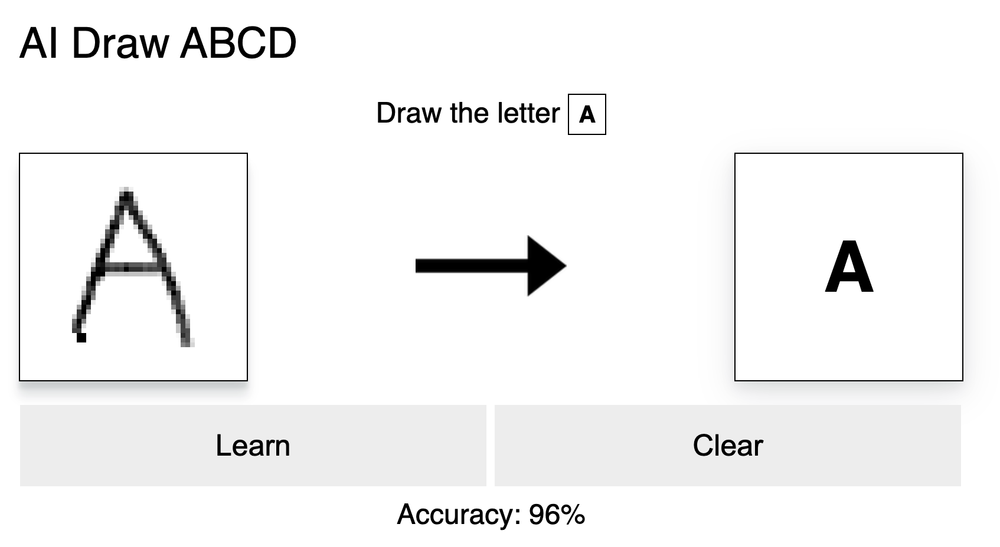
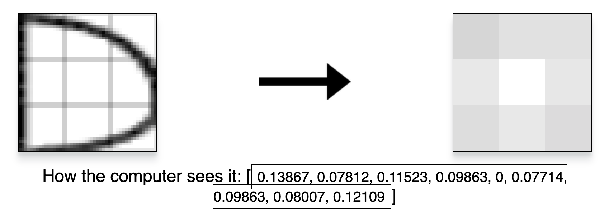

# Machine Learning Letters:

This is a simple project demonstrating how AI can differentiate different letters by modifying the image pixel matrix. This project is a simplified version of how AI is able to recognize handwritten letters by having a large data set of drawings and have them compiled into data.

This little experimental project was just for educational purposes and shouldn't be used as more than that.

*NOTE: this project is only limited to letters ABCD*


## How to use it:

### Data:

The current demo doesn't have any precompiled data so you would run the model with empty data. However, in the HTML file, you can uncomment line 97 (`<!-- <script src="data.js"></script> -->`) to have access to precompiled data so that it wouldn't need to be trained.

### Drawing & Learning:

The first section of the project will prompt you to draw the letter that it says with the text **Draw The Letter** as seen in the image below. You would use the cursor and hold on the canvas to draw the letter you want the AI to guess.



The two buttons below allow you to "Learn", meaning that the data is then compiled into its database, or "Clear" which means you restart the drawing.

### Interpreting the Drawing:

After that, your drawing will be shown below and converted into a 3 by 3 floating point matrix to demonstrate how the computer perceives the drawing that you drew.



## How it works:

1. The first step the AI takes is to take the image that was drawn and stretch it at the maximum corners to use the most out of the drawing. 
    * This part is done by having the program track mouse location when drawing and just recording the minimum and maximum points of the drawing.
2. Then it takes the drawing and separates it into a 3 by 3 grid and calculates the percentage grey space in those 9 regions. 
    * This takes a Uint8Array of the region calculates the none white spaces (meaning all numbers less than 255) and gets a percentage of how many darker colors there are relative to the white ones.
3. Finally, the AI cross references your drawing to an average of all the previously compiled drawings in the database and makes a guess based on which letter is closest to the drawing.

## How it's coded:

The entire project is coded in JavaScript as the core and has HTML and CSS for the styling of the project. This project doesn't rely on any libraries and is entirely coded from the ground up. No libraries were used in the making of this.

*NOTE: to create the drawing system I used this Stackoverflow answer: [https://stackoverflow.com/questions/2368784/draw-on-html5-canvas-using-a-mouse](https://stackoverflow.com/questions/2368784/draw-on-html5-canvas-using-a-mouse)*

### Using the Code:

If you would like to get the 9-float array of the canvas you can write the following line of code:

```javascript
var drawingData = MachineLearning.Data.createValue();
// returns an array of 9 floating point numbers
```

To have the system guess the letter based on the data you can write the following:


```javascript

var drawingData = MachineLearning.Data.createValue();
// returns an array of 9 floating point numbers

var guess = MachineLearning.Data.guess(drawingData);
// returns either "?" or one of the letters between A,B,C or D

// NOTE: you can also create your own set of values 
// use another set of predefined values you don't need
// to use the create value function

```

If you want to get the average of a letter in the database you would write the following:

```javascript
var averageA = MachineLearning.Data.averageOutArray("A");
// returns the average of all the drawings in the database for "A"
```

If you want to get the values in the database you could write these two options:

```javascript
var jsonString = MachineLearning.Data.recieveData();
// returns a JSON string if you want to store it as a file

var jsonObject = MachineLearning.Data.knowledge;
// this will give you the direct object with all the data for all the different letters

```

## Privacy:

Any drawings and other data you put into the website are stored exclusively on your computer. There are no data bases collecting your data and all JavaScript runs on the client side.

